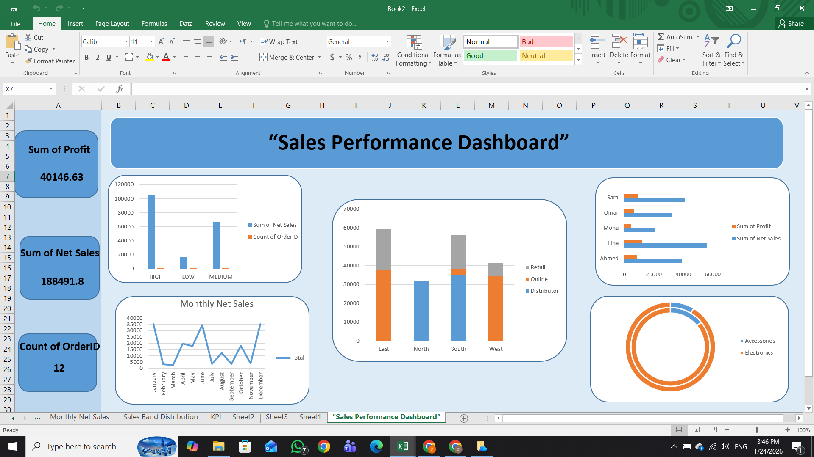

# Excel Dashboard Project 📊

## Overview

This project presents an interactive **Excel Dashboard** designed to analyze and visualize data in a clear and dynamic way.
The dashboard helps users quickly understand key insights, identify trends, and support data-driven decision making.

## Features

* Interactive **Dashboard Interface**
* Data analysis using **Pivot Tables**
* Visual representation using **Charts and Graphs**
* **Slicers and Filters** for dynamic data exploration
* Clean and organized layout for easy understanding

## Tools Used

* Microsoft Excel
* Pivot Tables
* Pivot Charts
* Slicers
* Data Visualization Techniques

## Purpose of the Project

The main goal of this project is to transform raw data into meaningful insights through a well-structured dashboard.
It demonstrates how Excel can be used as a powerful tool for **data analysis and visualization**.

## Project Structure

```
excel-dashboard/
│
├── data/               # Dataset used in the dashboard
├── dashboard/          # Excel dashboard file
├── images/             # Screenshots of the dashboard
└── README.md           # Project documentation
```

## How to Use

1. Download the Excel file from the repository.
2. Open it using **Microsoft Excel**.
3. Use the **filters and slicers** to interact with the dashboard.
4. Explore insights and visualizations from the data.

## Author

**Zeina Alanour**





